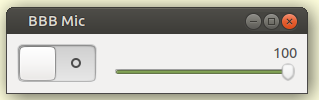

# BBB Microphone

When using Big Blue Button (BBB) and presenting, then your microphone is 
normally the only audio output stream from your PC. Thus, if you run an application that 
generates audio, then this audio will not be heard by the audience, except for any audio 
that is output from the presenters PC speakers and then leaks back 
into their microphone.

When using the Firefox browser, and enabling your microphone, then you get 
the choice of a *Microphone*, for example, *Webcam C170 Mono*, or *Monitoring of Built-in Audio Analog Stereo*. Select the
*Monitoring of Built-in Audio Analog Stereo*. When you run an audio application, for example `$ mpv my_music.wav` then the BBB
audience will hear this music.

When running either of these *BBB Microphone* programs then your microphone will be 
added to the built-in audio.

WARNING: The presenter will need a headset, to avoid feedback. Thus the 
presenter must be remote from any live audience in a room listening to audio over a
rooms public address system.

There are two versions of **BBB Microphone**

* `bbb_mic_console_static.py` Which is run in a console window and has its volume fixed.

* `bbb_mic_gui_dynamic.py` Which is a gui app that has widgets to adjust the volume of the microphone or to mute/unmute it.

